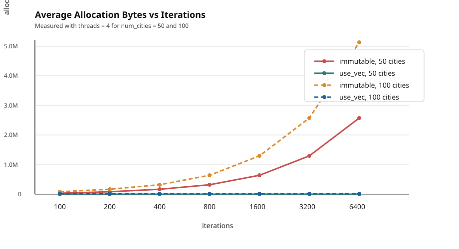

# Use Transformation with `orx-parallel`

`use` transformations provide a safe and ergonomic way to use mutable worker-local state in parallel pipelines.

Highlights:

- convenience and safety: no unsafe code in application-level iterator logic
- memory efficiency: exactly one use-variable per worker thread
- predictable allocation behavior for stateful workloads

## Ways to use mutable thread local variables

### 1. `use_new`: Random number generators, a very common use case

> `use_new` creates one variable per thread and makes its mutable reference available to thread-local computations. Created *use variables* are dropped once the computation finalizes.

Recall the entry example in the library, which demonstrates parallelization with the iterator API:

```rust
use orx_parallel::*;
use rand::prelude::*;

struct Tour(Vec<usize>);

impl Tour {
    fn random(n: usize) -> Self {
        let mut cities: Vec<_> = (0..n).collect();
        cities.shuffle(&mut rand::rng());
        Self(cities)
    }

    fn starts_at_coffee_shop(&self) -> bool {
        self.0.first() == Some(&7)
    }

    fn duration(&self) -> u64 {
        let links = self.0.iter().zip(self.0.iter().skip(1));
        links
            .map(|(a, b)| (*a as i64 - *b as i64).unsigned_abs())
            .sum::<u64>()
    }
}

let num_tours = 1_000_000;
let num_cities = 10;

// parallel
let best_tour = (0..num_tours)
    .par() // ← parallelized
    .map(|_| Tour::random(num_cities))
    .filter(|t| t.starts_at_coffee_shop())
    .min_by_key(|t| t.duration());
```

Does something bother you?

The `Tour::random` function needs a random number generator (RNG). However, RNGs are stateful and are only useful with mutable references. If we created one RNG and shared it with all threads, we would have a race condition.

Therefore, in the example above, we create a new random RNG per created tour. This is not how we normally use RNGs; we normally create one and consume the sequence of random numbers it produces.

We know that we cannot work with one RNG due to race conditions, but we could have `T` RNGs where `T` is the number of threads.

With `orx-parallel`, we can ask the parallel iterator to create exactly one RNG per thread and make it available to iterator methods.

```rust
use orx_parallel::*;
use rand::prelude::*;
use rand_chacha::ChaCha8Rng;

struct Tour(Vec<usize>);

impl Tour {
    fn random(rnd: &mut impl Rng, n: usize) -> Self {
        let mut cities: Vec<_> = (0..n).collect();
        cities.shuffle(rnd);
        Self(cities)
    }

    fn starts_at_coffee_shop(&self) -> bool {
        self.0.first() == Some(&7)
    }

    fn duration(&self) -> u64 {
        let links = self.0.iter().zip(self.0.iter().skip(1));
        links
            .map(|(a, b)| (*a as i64 - *b as i64).unsigned_abs())
            .sum::<u64>()
    }
}

let num_tours = 1_000_000;
let num_cities = 10;

// sequential
let mut rnd = rand::rng();
let best_tour = (0..num_tours)
    .map(|_| Tour::random(&mut rnd, num_cities))
    .filter(|t| t.starts_at_coffee_shop())
    .min_by_key(|t| t.duration());

let best_tour = (0..num_tours)
    .par() // ← parallelized
    .use_new(|th_idx| ChaCha8Rng::seed_from_u64(42 * th_idx as u64)) // ← seeded
    .map(|rng, _| Tour::random(rng, num_cities)) // ← a mut rng is now available
    .filter(|_, t| t.starts_at_coffee_shop())
    .min_by_key(|_, t| t.duration());
```

### 2. `use_vec`: Collecting thread local information

> `use_vec` creates one variable per thread, holds them in a vector of length `T`, and can be used after parallel computation finalizes.

For instance, one can simply collect results into thread-local vectors and get them all back.

```rust
use orx_parallel::*;

let mut thread_results = UseVec::new(|_th_idx| vec![]);

(0..1_000)
    .par()
    .use_vec(&mut thread_results) // ← mutably lend it to parallel iterator
    .for_each(|vec, x| vec.push(x.to_string())); // ← vec: &mut Vec<String>

let results: Vec<Vec<String>> = thread_results.into_vec();
assert_eq!(1_000, results.iter().map(|x| x.len()).sum::<usize>());
```

Or you may evaluate some metrics for each thread to observe work distribution.

```rust
use orx_parallel::*;

#[derive(Default, Debug)]
struct ThreadMetrics {
    num_items_handled: usize,
    handled_12345: bool,
    num_filtered_out: usize,
}

let input: Vec<u64> = (0..1_000_000).collect();

// define how to create thread-local variables
let mut thread_metrics = UseVec::new(|_th_idx| ThreadMetrics::default());

let total = input
    .par()
    .num_threads(8)
    .use_vec(&mut thread_metrics) // ← mutably lend it to parallel iterator
    .map(|metrics, x| {
        metrics.num_items_handled += 1;
        metrics.handled_12345 |= *x == 12345;

        x + x / 7 + 17
    })
    .filter(|metrics, x| match x.is_multiple_of(3) {
        true => true,
        false => {
            metrics.num_filtered_out += 1;
            false
        }
    })
    .sum();
assert_eq!(total, 190481523804);

let thread_metrics = thread_metrics.into_vec(); // ← get created vars back
for (th_idx, metrics) in thread_metrics.iter().enumerate() {
    println!("[th-{th_idx}]\t{metrics:?}");
}

/* output:
[th-0]  ThreadMetrics { num_items_handled: 130212, handled_12345: false, num_filtered_out: 86816 }
[th-1]  ThreadMetrics { num_items_handled: 106251, handled_12345: false, num_filtered_out: 70828 }
[th-2]  ThreadMetrics { num_items_handled: 112540, handled_12345: false, num_filtered_out: 75035 }
[th-3]  ThreadMetrics { num_items_handled: 176754, handled_12345: false, num_filtered_out: 117822 }
[th-4]  ThreadMetrics { num_items_handled: 110223, handled_12345: false, num_filtered_out: 73475 }
[th-5]  ThreadMetrics { num_items_handled: 110554, handled_12345: true, num_filtered_out: 73713 }
[th-6]  ThreadMetrics { num_items_handled: 126773, handled_12345: false, num_filtered_out: 84523 }
[th-7]  ThreadMetrics { num_items_handled: 126693, handled_12345: false, num_filtered_out: 84455 }
*/
```

### 3. `use_slice`: Pre-created use variables

> `use_slice` works exactly like `use_vec` except that the thread local variables are pre-created.

`use_slice` will not create any use variables; instead, it safely uses the provided slice of use variables. Therefore, unlike `use_vec`, the length of the provided slice is an upper bound on the number of threads that the parallel computation can use.

```rust
use orx_parallel::*;

let mut thread_results = vec![Vec::new(); 8]; // ← caps num threads to 8

(0..1_000)
    .par()
    .use_slice(&mut thread_results) // ← mutably lend it to parallel iterator
    .for_each(|vec, x| vec.push(x.to_string())); // ← vec: &mut Vec<String>

assert_eq!(1_000, thread_results.iter().map(|x| x.len()).sum::<usize>());
```

## Impact on memory efficiency

> Detailed documentation and source code of the demonstration can be found in [par_immutable.rs](https://github.com/orxfun/orx-parallel/tree/main/examples/use_impact_on_memory).

We use a traveling salesperson problem to demonstrate a possible use of *use transformation* and its impact on memory efficiency. In the algorithm:

* we create many random tours,
* we locally optimize each of them (heavy computation part),
* pick and return the shortest one found.

### Initial approach, immutable design

```rust
/// creates a random tour
fn random_tour(seed: u64, num_cities: usize) -> Vec<usize> { /*..*/ }

/// takes `tour`, and returns the improved tour and its distance
fn two_opt_improve(locations: &[Location], tour: Vec<usize>) -> (Vec<usize>, u64)  { /*..*/ }

/// returns the shortest found tour for the given `locations`
pub fn run_search_parallel_immutable(
    locations: &[Location],
    iterations: usize,
    seed: u64,
) -> Option<(Vec<usize>, u64)> {
    (0..iterations)
        .par()
        .map(|k| random_tour(seed, k))
        .map(|tour| two_opt_improve(locations, tour))
        .min_by_key(|(_tour, distance)| *distance)
}
```

This is a nice immutable design that creates, improves and evaluates `iterations` tours and returns the shortest one.

However, in performance critical applications, allocations might be a problem. Notice that this implementation will allocate `iterations` vectors just to return only one best tour.

In a sequential implementation, we could have managed this with `2` vector allocations: one would be the temporary tour and the other is the best-so-far.

### Memory optimization with use transformation

With thread-local mutable variables, parallel implementation can be achieved by using `2 x T` vector allocations for `T` threads. Note that this reduces the space complexity from linear to constant.

```rust
struct ThreadData {
    min_cost: u64,
    temp_tour: Vec<usize>,
    best_tour: Vec<usize>,
}

impl ThreadData {
    fn new(num_cities: usize) -> Self {
        Self {
            min_cost: u64::MAX,
            temp_tour: (0..num_cities).collect(),
            best_tour: (0..num_cities).collect(),
        }
    }

    fn evaluate_temp_tour(&mut self, cost: u64) {
        if cost < self.min_cost {
            self.min_cost = cost;
            // temp tour becomes the best tour
            core::mem::swap(&mut self.temp_tour, &mut self.best_tour);
        }
    }
}

/// randomizes the sequence of the mutable `tour` in-place
fn randomize_tour(seed: u64, tour: &mut [usize]) { /*..*/ }

/// takes a mutable `tour` and improves it in-place, returns its distance
fn two_opt_improve(locations: &[Location], tour: &mut [usize]) -> u64 { /*..*/ }

/// returns the shortest found tour for the given `locations`
pub fn run_search_parallel_use_mut(
    locations: &[Location],
    iterations: usize,
    seed: u64,
) -> Option<(Vec<usize>, u64)> {
    let mut data = UseVec::new(|_| ThreadData::new(locations.len()));

    (0..iterations)
        .par()
        .use_vec(&mut data)
        .for_each(|data, _| {
            randomize_tour(seed, &mut data.temp_tour);
            let cost = two_opt_improve(locations, &mut data.temp_tour);
            data.evaluate_temp_tour(cost);
        });

    data.into_vec()
        .into_iter()
        .min_by_key(|x| x.min_cost)
        .map(|x| (x.best_tour, x.min_cost))
}
```

Significance of this design choice in memory requirement is represented in the chart below where the x-axis is `iterations`, and the y-axis is average allocation bytes reported by the example.


