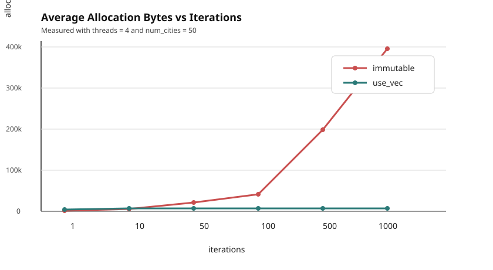

# Impact of `use` transformation on memory allocation

This example demonstrates the impact of a `use` transformation on a parallel traveling-salesperson-style search.

The example compares two designs:

1. An immutable implementation in [par_immutable.rs](https://github.com/orxfun/orx-parallel/blob/main/examples/use_demo_tsp/par_immutable.rs).
2. A per-thread mutable implementation in [par_with_use.rs](https://github.com/orxfun/orx-parallel/blob/main/examples/use_demo_tsp/par_with_use.rs).

## Immutable Design

The immutable implementation in [par_immutable.rs](https://github.com/orxfun/orx-parallel/blob/main/examples/use_demo_tsp/par_immutable.rs) is clean, direct, and pleasant to read. Each iteration:

1. creates a random tour,
2. improves it with 2-opt,
3. computes its distance, and
4. returns the resulting `(tour, distance)` pair.

This version works well and is a good default starting point.

The tradeoff is allocation behavior. Each iteration constructs a fresh `Vec<usize>` for the tour. As a result, allocation grows with problem size and search intensity. If `num_cities` also increases, the per-iteration allocation cost grows as well.

In memory-tight situations, this can become a problem.

```rust
fn run_search_parallel_immutable(
    locations: &[Location],
    iterations: usize,
    seed: u64,
    threads: usize,
) -> Option<(Vec<usize>, f64)> {
    (0..iterations)
        .into_par()
        .num_threads(threads)
        .map(|k| search_candidate(locations, seed_for(seed, k)))
        .min_by(|a, b| a.1.partial_cmp(&b.1).unwrap_or(Equal))
}
```

## `use_vec` Design

The mutable design in [par_with_use.rs](https://github.com/orxfun/orx-parallel/blob/main/examples/use_demo_tsp/par_with_use.rs) uses worker-local state:

- `temp_tour` stores the current candidate tour for a thread.
- `best_tour` stores the best tour found so far by that thread.

This is represented by `ThreadData`, and one `ThreadData` value is created per worker thread through `UseVec`.

Compared to the clean immutable variant, this version is a bit more complicated. However, it is still straightforward and not overly complex. The important point is that the example code does not need any `unsafe`. `orx-parallel` exposes a safe API that makes per-thread mutable variables available directly inside the parallel computation.

Allocation behavior is the reason to consider this design. Here we allocate two tour vectors per active worker thread instead of allocating a new tour per iteration. That changes the scaling behavior:

- immutable: allocation grows with number of cities and number of iterations.
- `use_vec`: allocation grows with number of threads and number of cities; however, it is **constant** in number of iterations.

```rust
struct ThreadData {
    min_cost: f64,
    temp_tour: Vec<usize>,
    best_tour: Vec<usize>,
}

impl ThreadData {
    fn new(num_cities: usize) -> Self { /*...*/ }

    fn evaluate_temp_tour(&mut self, cost: f64) {
        if cost < self.min_cost { // temp tour becomes the best tour
            self.min_cost = cost;
            core::mem::swap(&mut self.temp_tour, &mut self.best_tour);
        }
    }
}

fn run_search_parallel_use_mut(
    locations: &[Location],
    iterations: usize,
    seed: u64,
    threads: usize,
) -> Option<(Vec<usize>, f64)> {
    let mut data = UseVec::new(|_| ThreadData::new(locations.len()));

    let par = (0..iterations).into_par().num_threads(threads);
    let par = par.use_vec(&mut data);
    par.for_each(|data, k| {
        let cost = search_candidate(locations, seed_for(seed, k), &mut data.temp_tour);
        data.evaluate_temp_tour(cost);
    });

    data.into_vec()
        .into_iter()
        .min_by(|x, y| x.min_cost.partial_cmp(&y.min_cost).unwrap_or(Equal))
        .map(|x| (x.best_tour, x.min_cost))
}
```

## Why This Matters

This example is meant to show what `use` transformations affect in practice:

- They let you keep mutable state local to each worker.
- They avoid repeated allocation inside hot iteration loops.
- They often reduce pressure on the allocator substantially.
- They can improve performance, but the primary win is often memory behavior and allocation stability.

## Running The Example

The example supports these arguments:

```bash
cargo run --release --example use_demo_tsp -- --iterations 100 --threads 4 --num-cities 50
```

The output reports average time and average allocation statistics for both variants.

## Allocation Growth By Iterations

The following chart was generated from a series of runs with:

- `threads = 4`
- `num_cities = 50` and `100`
- `rounds = 5`

The x-axis is `iterations`, and the y-axis is average allocation bytes reported by the example.



### Measured Data

| iterations | immutable bytes, 50 cities | `use_vec` bytes, 50 cities | immutable bytes, 100 cities | `use_vec` bytes, 100 cities |
| ---------- | -------------------------- | -------------------------- | --------------------------- | --------------------------- |
| 100        | 41158                      | 7250                       | 81158                       | 10450                       |
| 200        | 81158                      | 7250                       | 161158                      | 10450                       |
| 400        | 161158                     | 7250                       | 321158                      | 10450                       |
| 800        | 321158                     | 7250                       | 641158                      | 10450                       |
| 1600       | 641158                     | 7250                       | 1281158                     | 10450                       |
| 3200       | 1281158                    | 7250                       | 2561158                     | 10450                       |
| 6400       | 2561158                    | 7250                       | 5121158                     | 10450                       |

The chart makes the behavior easy to see:

- immutable allocation grows roughly linearly with `iterations`
- doubling `num_cities` roughly doubles immutable allocation at the same iteration count
- `use_vec` allocation remains flat as `iterations` increases
- `use_vec` still depends on `num_cities`, but that dependency is paid once per worker-local state rather than once per iteration

That is the practical effect of the `use` transformation in this example.