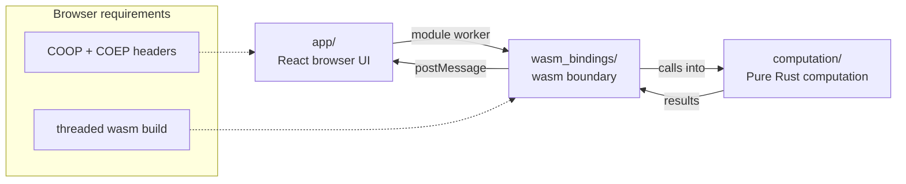

# orx-parallel wasm TSP react

You can check, test, and play around with the built application at:
https://orx-parallel-wasm-demo-tsp.pages.dev/

This example shows the recommended web structure for `orx-parallel` with a React + Vite host app:

- `computation/` contains pure Rust TSP logic
- `wasm_bindings/` exposes a thin wasm API for that computation
- `app/` is the browser app that consumes the wasm bindings through composable React components

The same structure works for other parallelizable Rust workloads too. The important part is the separation: keep the algorithm in Rust, keep the wasm layer thin, and keep the UI focused on orchestration and presentation.

For the practical build flow, jump to [Building a browser UI with `orx-parallel`](#building-a-browser-ui-with-orx-parallel).



## Project responsibilities

### `computation/`

This crate contains the actual TSP implementation. It is the best place to add benchmarks, unit tests, and algorithm changes.

Use this crate for anything that should stay independent from the web platform:

- instance generation
- tour construction and improvement
- sequential and parallel search strategies

### `wasm_bindings/`

This crate is the boundary between Rust and JavaScript. It should stay thin.

Its job is to:

- expose wasm-safe functions such as `locations`, `init_wasm_parallel_runtime`, and `run_search`
- serialize and deserialize values at the edge
- initialize the parallel runtime before the first parallel search

### `app/`

This is the browser application. It owns the page, worker lifecycle, controls, and rendering.

The app is intentionally split into composable React components (for controls, status, code cards, and canvas rendering), but it keeps the same runtime flow and worker boundary as the other examples.

## Execution flow

1. The UI creates or loads a TSP instance.
2. The UI sends the request to a worker.
3. The worker calls `init()` for the generated wasm package.
4. If the request is parallel, the worker calls `init_wasm_parallel_runtime(thread_count)` before the first `run_search`.
5. `run_search` executes the Rust computation and returns the result to the worker.
6. The worker posts the result back to the UI.

The worker can be short-lived, or it can be kept alive and reused across searches. In either case, each worker that runs parallel work must call `init_wasm_parallel_runtime` once before its first parallel search.

## Important rules for parallel wasm on the web

Parallel wasm in the browser has a few hard requirements. Missing any one of them usually leads to code that still runs, but no longer uses parallel execution.

### 1. Build wasm with thread support enabled

The wasm build must target shared-memory/threaded wasm. In practice, that means using the build setup from `app/package.json` and the Rust configuration in `computation/` and `wasm_bindings/`.

If you change the Rust code, rebuild the wasm package before running the UI again.

### 2. Serve the app with cross-origin isolation headers

Browser threads require `Cross-Origin-Opener-Policy` and `Cross-Origin-Embedder-Policy` headers. Without them, `SharedArrayBuffer` is unavailable and the threaded path cannot work.

A plain static server is usually not enough. Use the Vite dev server or a server that sends the same headers for the built app.

```ts
// app/vite.config.ts
import { defineConfig } from "vite";

export default defineConfig({
    server: {
        headers: {
            "Cross-Origin-Opener-Policy": "same-origin",
            "Cross-Origin-Embedder-Policy": "require-corp"
        }
    }
});
```

### 3. Initialize the parallel runtime once before the first parallel search

Call `init_wasm_parallel_runtime` once in each worker that will execute parallel work.

Do not assume that one worker initializing the runtime automatically prepares every other worker. If you create a new worker, that worker must initialize its own runtime before parallel search.

## Testing strategy

The separation also makes testing straightforward:

- test the algorithm in `computation/` with ordinary Rust tests
- test the wasm boundary in `wasm_bindings/`
- test UI behavior in `app/`

That division is deliberate. It lets you validate the core search independently from the browser and only use wasm tests where they are actually needed.

## Read next

- [computation README](./computation/README.md)
- [wasm bindings README](./wasm_bindings/README.md)
- [App README](./app/README.md)

The `app/README.md` contains the exact setup and run commands for the browser app, while `wasm_bindings/README.md` documents the wasm API surface.

## Building a browser UI with `orx-parallel`

1. Decide what should stay in Rust.

   Put the pure-Rust computation in `computation/`. Keep it independent from the browser so it can be tested and benchmarked as a normal Rust crate.

   This layer may expose many functions: some may use parallel execution, others may stay sequential, but none of them should depend on UI, DOM, or JavaScript concerns.

2. Expose only a thin wasm API.

   Add `wasm_bindings/` as the bridge between Rust and JavaScript. Its job is always the same: expose `init_wasm_parallel_runtime` and re-export the computation functions with `wasm_bindgen` so the UI can call them from the browser.

3. Build the UI around a worker boundary.

   Let the browser UI live in `app/`, and have it talk to the wasm package through a module worker. The UI should orchestrate when and how computations are triggered, not reimplement them.

   In this example, React components divide rendering by responsibility (controls, status, canvas, and code cards) while keeping the execution pipeline unchanged.

4. Enable browser threads in the build.

   Compile the wasm package with the threaded configuration from `app/package.json` and the Rust feature wiring in `computation/` and `wasm_bindings/`. If the build is not thread-enabled, the parallel path will not actually run in parallel.

5. Make sure the app is served with cross-origin isolation.

   Use Vite or another server that sends `Cross-Origin-Opener-Policy` and `Cross-Origin-Embedder-Policy` headers. Without them, the browser cannot use `SharedArrayBuffer`, so threaded wasm will fail.

6. Initialize wasm inside each worker before running search.

   Call `init()` first, then call `init_wasm_parallel_runtime(thread_count)` once per worker before the first parallel execution. If you create a new worker, that worker must initialize its own runtime too.

   The same worker can then invoke any exposed computation function, parallel or sequential.

7. Pass data through the wasm boundary in a simple shape.

   Generate or load the input data in JavaScript, send it to the wasm function you need, and return the result back to the UI. Keep the exchanged data small and explicit so the boundary stays easy to reason about.

8. Tune execution settings from the UI.

   Expose thread count and other tuning knobs as user-facing settings if you need them. Good values depend on the workload and browser, so start modestly and measure before increasing them.

9. Test each layer independently.

   Verify the Rust computation with ordinary Rust tests, verify the wasm boundary in `wasm_bindings/`, and verify the browser behavior in `app/`. This is the main advantage of the three-project layout.

10. Keep the architecture strict.

    Do not move computation logic into the UI, do not let the computation crate depend on DOM APIs, and do not turn the wasm bindings into a second implementation layer. The example stays reliable only if each project keeps its role.
